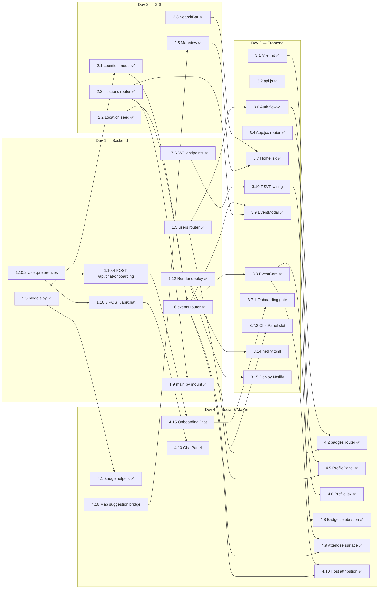

# Cross-Workstream Dependency Index

**Last updated:** 2026-05-23 (Dev 2 GIS stream complete; Maxxer subtasks 1.10.x / 3.7.x / 4.13–4.18 remain)
**Source:** `STATE.md` (post-restructure, 4-dev split + Maxxer agent workstream)

> One-page index of how the four dev workstreams gate each other. Per-dev detail lives in `dev{1,2,3,4}-dependencies.md`. The graph below shows only **cross-workstream** edges — intra-dev chains are in each per-dev file.

---

## Per-Dev Files

- [Dev 1 — Backend Foundation](dev1-dependencies.md) — Original critical path ✅ COMPLETE (1.1–1.12 all done; live at https://commaxx-api.onrender.com/). Remaining Maxxer path: `1.10.1 → 1.10.3 → 1.10.5`.
- [Dev 2 — GIS / Mapping](dev2-dependencies.md) — ✅ COMPLETE except 2.7 deferred SVG assets (2.1–2.6 and 2.8–2.10 done).
- [Dev 3 — Frontend Foundation](dev3-dependencies.md) — Critical path: `3.10 → 3.15` (two tasks; 3.1, 3.2, 3.3, 3.4, 3.5, 3.6, 3.7, 3.8, 3.9, 3.13 ✅ DONE). Plus new Maxxer shell slots 3.7.1 and 3.7.2.
- [Dev 4 — Badges, Notifications, Social + Maxxer](dev4-dependencies.md) — Original critical path ✅ COMPLETE (4.1–4.12 done). Remaining Maxxer path: `4.13 → 4.14 → 4.18`.

---

## Cross-Workstream Dependency Graph

---

## Global Critical Path

**Original core path complete.** The earlier longest chain `1.1 → 1.2 → 1.3 → 1.6 → 1.7 → 3.10 → 4.8 → 4.12` is ✅ done up to 1.7. The remaining unfinished spine of the core product is:

`3.10 → 3.15` (two tasks; RSVP wiring then Netlify deploy).

**Remaining Maxxer path:** `1.10.1 → 1.10.3 → 4.13 → 4.16 → 4.18` (five steps; Anthropic dep → chat endpoint → ChatPanel → map bridge → QA sign-off). 1.10.4 + 4.15 (onboarding) is a parallel branch of similar depth.

**Other paths still in flight:**
- **Deploy:** `3.15` depends on 3.10 ✅ and (soft) on 3.14 + 1.12 ✅.

---

## Merge-Order Implications

**STATE.md's stated merge order:** Dev 1 → (Dev 2 + Dev 3 parallel) → Dev 4. **In practice:** Dev 1 has fully merged its core; Dev 4's badges/social merged after Dev 3's 3.6; Dev 2 and Dev 3 are interleaving final pieces.

**Where parallelism is real now:**
- **Maxxer kickoff is fully parallel:** Dev 1's 1.10.1 (Anthropic dep) and 1.10.2 (User.preferences) are independent siblings; 1.10.3 and 1.10.4 fan out after.
- **Dev 4's 4.13 + 4.15 can scaffold with mocked chat responses** before Dev 1's chat endpoints land.
- **Dev 3's 3.10 (RSVP wiring) is fully unblocked** — Dev 1's 1.7 is on main.
- **Dev 2's 2.8 (SearchBar), 2.9 (sync), and 2.10 (mobile map UX)** are shipped.

**Where parallelism is illusory:**
- Dev 4's 4.16 (map suggestion bridge) and Dev 2's MapView need to coordinate the `highlightedEventIds` prop shape.
- Dev 3's 3.15 (deploy) is gated on everything else effectively complete; not a parallel concern.

**Recommended remaining sequence:**
1. **Dev 1:** ship 1.10.1 + 1.10.2 in parallel; then 1.10.3 + 1.10.4; then 1.10.5.
2. **Dev 2:** no active implementation tasks remain; 2.7 waits on bespoke SVG assets from design.
3. **Dev 3:** ship 3.10 immediately (highest leverage; closes the RSVP loop); then 3.7.1 + 3.7.2 slots once Dev 4 has stubs; then 3.11/3.12 polish; finally 3.14 + 3.15.
4. **Dev 4:** scaffold 4.13 + 4.15 against mocks now; wire to real endpoints when Dev 1 lands 1.10.3 / 1.10.4; then 4.14 / 4.16 / 4.17; 4.18 closes out.

The single highest-leverage remaining deliverable is **Dev 1's 1.10.3 (`POST /api/chat`)** — it unblocks Dev 4's entire Maxxer UX chain (4.13 → 4.14 → 4.16 → 4.17) and Dev 3's ChatPanel slot (3.7.2).
