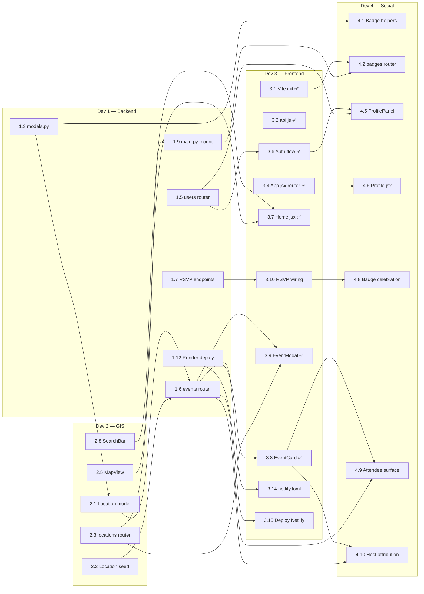

# Cross-Workstream Dependency Index

**Last updated:** 2026-05-23 (3.6 auth flow shipped on `feat-3.6` PR #14)
**Source:** `STATE.md` (post-restructure, 4-dev split)

> One-page index of how the four dev workstreams gate each other. Per-dev detail lives in `dev{1,2,3,4}-dependencies.md`. The graph below shows only **cross-workstream** edges — intra-dev chains are in each per-dev file.

---

## Per-Dev Files

- [Dev 1 — Backend Foundation](dev1-dependencies.md) — Critical path: `1.1 → 1.2 → 1.3 → 1.6 → 1.7 → 1.9 → 1.11 → 1.12` (eight tasks; the foundation everyone is blocked on).
- [Dev 2 — GIS / Mapping](dev2-dependencies.md) — Critical path: `2.1 → 2.3 → 2.5 → 2.6 → 2.9` (five tasks; spans backend + frontend, owns `GET /api/locations`).
- [Dev 3 — Frontend Foundation](dev3-dependencies.md) — Critical path: `3.10 → 3.15` (two tasks; 3.1, 3.2, 3.3, 3.4, 3.5, 3.6, 3.7, 3.8, 3.9, 3.13 already ✅ DONE).
- [Dev 4 — Badges, Notifications, Social](dev4-dependencies.md) — Critical path: `4.1 → 4.2 → 4.4 → 4.8 → 4.12` (five tasks; every task has a cross-workstream blocker).

---

## Cross-Workstream Dependency Graph

---

## Global Critical Path

The longest chain of blocking work across all four streams:

`1.1 → 1.2 → 1.3 → 1.6 → 1.7 → 3.10 → 4.8 → 4.12`

Eight steps. The shape: Dev 1 builds the events + RSVP backend, Dev 3 wires it client-side, Dev 4 layers the badge celebration on the RSVP success path, and the README closes out.

Other notable end-to-end paths:
- **Deploy path:** `1.1 → 1.2 → 1.3 → 1.6 → 1.9 → 1.12 → 3.15` (seven steps; what "the app is live" requires).
- **Map-end-to-end:** `1.3 → 2.1 → 2.3 → 2.5 → 3.7 → 3.15` (six steps; what "map shows seeded locations in production" requires).
- **Profile path:** `1.3 → 1.5 → 3.6 → 4.5 → 4.6 → 3.15` (six steps; what "I can see my badges live" requires).

---

## Merge-Order Implications

**STATE.md's stated merge order:** Dev 1 → (Dev 2 + Dev 3 parallel) → Dev 4.

**What the dep graph confirms:**
- Dev 1 must merge first. Every other stream has at least one Dev-1 dep (most have several).
- Dev 4 must merge last. Every Dev 4 task has at least one cross-workstream blocker; none of its outputs gate another stream's critical path.

**What the dep graph challenges:**
- "Dev 2 + Dev 3 in parallel" is partially true. They don't block each other on critical-path *code*, but they share three frontend files (`api.js`, `App.jsx`, `EventCard.jsx`) and two backend files (`main.py`, `models.py`, `seed.py` — though `models.py` and `seed.py` are mostly a Dev-1 ↔ Dev-2 concern). True parallelism requires careful merge discipline on these files.
- Dev 2 has a hidden backend gating Dev 1: Dev 1's 1.4 (event seed) and 1.6 (events with location) both depend on Dev 2's 2.1 (Location model) and 2.2 (location seed). The merge order doesn't capture this — Dev 2's backend tasks must interleave with Dev 1's, not strictly follow.

**Where parallelism is real:**
- Dev 3's 3.1, 3.2, 3.13 are already ✅ DONE. Dev 4 can start 4.3 (client badge metadata) and 4.11 (notification stubs) **immediately** — they only need the Vite project.
- Dev 2 can start 2.4 (constants) and 2.7 (SVG markers) immediately for the same reason.
- Dev 1's 1.10 (render.yaml) has no code deps and can be written any time.

**Where parallelism is illusory:**
- Dev 4 cannot meaningfully start its UI components until Dev 1's 1.5/1.6/1.7 endpoints exist (they need real data).
- Dev 3's 3.10 (RSVP wiring) is the choke point — it blocks Dev 4's 4.8, and it itself waits on three intra-Dev-3 tasks plus Dev 1's 1.7.
- Dev 3's 3.15 (final deploy) waits on essentially everything finishing, including Dev 4's frontend work merging in. The "deploy" step is the last possible action, not a parallel concern.

**Recommended kickoff sequence:**
1. Dev 1 starts 1.1 → 1.2 → 1.3 (sequential, fast).
2. The moment 1.3 lands: Dev 2 starts 2.1 in parallel; Dev 4 starts 4.1 in parallel.
3. Concurrently: Dev 2 picks up 2.4 + 2.7, Dev 4 picks up 4.3 + 4.11 — none need Dev 1.
4. Dev 1 continues 1.4 (after 2.2 lands), 1.5, 1.6, 1.7 in parallel branches.
5. Dev 3's TODOs (3.3 onward) can start now since 3.1/3.2/3.13 are done — start with 3.4 → 3.5 → 3.7 to give Dev 2 the Home slot.

The single highest-leverage early deliverable is **Dev 1's 1.3 `models.py` scaffold**. It unblocks Dev 2's entire backend chain, Dev 4's entire backend chain, and indirectly the contract Dev 3's UI consumes.
