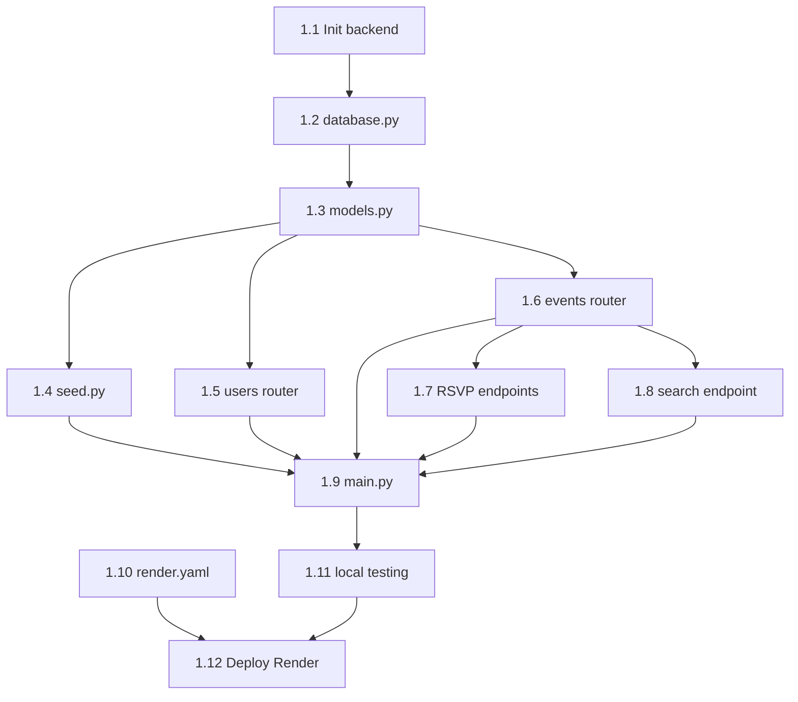

# Dev 1 Dependency Map — Backend Foundation

**Last updated:** 2026-05-23
**Source:** `STATE.md` (post-restructure, 4-dev split)
**Workstream:** Dev 1, branch `feature/backend` — FastAPI + DB + Users + Events + Deploy

> Dev 1 is the foundation layer. No tasks are ✅ DONE yet. Everyone else is gated on this stream: Dev 2 needs the `models.py` scaffold (1.3) before it can add the Location model; Dev 3's auth and RSVP wiring need users (1.5) and RSVP endpoints (1.7); Dev 4's badges need RSVP/Event tables (1.3). Dev 1 owes the most outbound unblocks of any stream.

---

## Dependency Table

| Task | Title | Intra-Dev-1 deps | Cross-workstream deps | External deps | Data contracts |
|------|-------|-------------------|------------------------|---------------|----------------|
| 1.1 | Init `backend/` + `requirements.txt` | — | — | pip: fastapi, uvicorn, sqlalchemy, pydantic | — |
| 1.2 | `database.py` — engine, session, `init_db()` | 1.1 | — | SQLAlchemy | — |
| 1.3 | `models.py` — User, Event, RSVP (Location owned by Dev 2 in 2.1) | 1.2 | Shared file with Dev 2's 2.1 — scaffold first | SQLAlchemy | DATA MODELS § User, Event, RSVP |
| 1.4 | `seed.py` — scaffold + 5 sample events | 1.3 | Blocked on Dev 2's 2.2 (location seed must land first so event FKs resolve); shared file | — | SEED DATA |
| 1.5 | `routers/users.py` — `POST/GET /api/users` | 1.3 | — | FastAPI, Pydantic | (no public schema, contract is name+email) |
| 1.6 | `routers/events.py` — `GET/POST /api/events`, `GET /api/events/{id}` | 1.3 | Response includes `location` object — depends on Dev 2's 2.1 Location model | FastAPI | `GET /api/events` schema in INTEGRATION POINTS |
| 1.7 | `routers/events.py` — RSVP endpoints | 1.3, 1.6 | — | FastAPI | (status: "going" \| "attended") |
| 1.8 | `routers/events.py` — `GET /api/search` | 1.3, 1.6 | — | FastAPI | (query params: q, type, date) |
| 1.9 | `main.py` — mount routers, CORS, seed on startup | 1.4, 1.5, 1.6, 1.7, 1.8 | Mounts Dev 2's 2.3 (locations router) and Dev 4's 4.2 (badges router); CORS must allow Netlify domain from Dev 3's 3.15 deploy | FastAPI | — |
| 1.10 | `render.yaml` — service config | — | — | Render | — |
| 1.11 | Test all endpoints locally | 1.9 | Needs Dev 2's 2.3 and Dev 4's 4.2 mounted to test full surface (inferred — can be partial without them) | curl / httpie | — |
| 1.12 | Deploy to Render, confirm health | 1.9, 1.10, 1.11 | Provides backend live URL that Dev 3's 3.14 (netlify.toml redirect) needs | Render | — |

---

## Intra-Dev-1 Task Graph

---

## Critical Path

`1.1 → 1.2 → 1.3 → 1.6 → 1.7 → 1.9 → 1.11 → 1.12`

Eight tasks. The events chain (1.6 → 1.7) is the longest fan-in before `main.py` (1.9). 1.10 (render.yaml) is parallel and short.

---

## Parallelizable Clusters

- **After 1.3:** 1.4 (seed), 1.5 (users router), 1.6 (events router) all fan out and can run in any order. Three parallel branches.
- **Standalone:** 1.10 (render.yaml) has no code dependencies — can be written at any point.
- **After 1.6:** 1.7 (RSVP) and 1.8 (search) are independent siblings.

---

## Earliest Unblock Points (what Dev 1 owes other streams)

1. **1.3 `models.py` scaffold** — unblocks Dev 2's 2.1 (Location model), which gates Dev 2's entire backend chain (2.2, 2.3). Highest leverage Dev 1 deliverable.
2. **1.5 `POST /api/users`** — unblocks Dev 3's 3.6 (auth flow), which gates Dev 3's 3.10 (RSVP wiring) and Dev 4's 4.5 (ProfilePanel).
3. **1.6 `GET /api/events`** — unblocks Dev 3's 3.8 (EventCard), 3.9 (EventModal), Dev 2's 2.9 (map ↔ list sync), Dev 4's 4.9, 4.10.
4. **1.7 RSVP endpoints** — unblocks Dev 3's 3.10 (RSVP wiring), which is a prerequisite for Dev 4's 4.8 (badge unlock).
5. **1.9 `main.py`** — required for Dev 2's 2.3 and Dev 4's 4.2 to be reachable. Without it, their routers are dead code.
6. **1.12 Render deploy** — final blocker for Dev 3's 3.14 and 3.15 (Netlify deploy with backend URL).

---

## Notes on Inferred Deps

- 1.4 (seed events) depends on Dev 2's 2.2 (location seed) because events have a `location_id` FK. If Dev 1 seeds first, foreign keys won't resolve.
- 1.6's response includes a `location` object — this is a soft dep on Dev 2's 2.1 Location model existing. If Dev 1 ships 1.6 before 2.1, the response builder will break.
- 1.11 (test endpoints) is technically possible without Dev 2/Dev 4 routers mounted but won't cover the full surface.
- CORS in 1.9 needs the Netlify domain, which isn't known until Dev 3's 3.15 deploy. Can use a wildcard or env var as a soft coupling.
