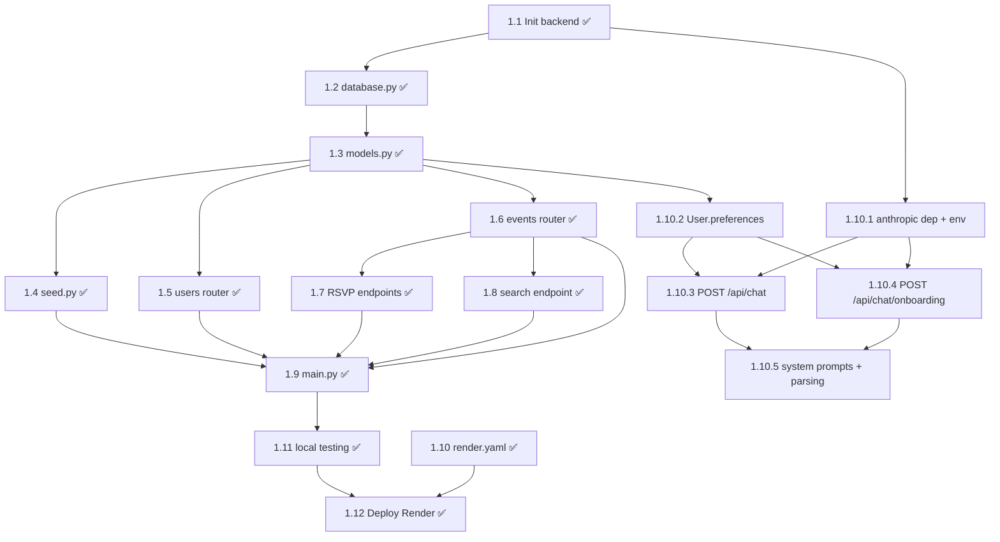

# Dev 1 Dependency Map — Backend Foundation

**Last updated:** 2026-05-23 (drift fix: 1.1–1.12 flipped ✅ to match origin/main)
**Source:** `STATE.md` (post-restructure, 4-dev split)
**Workstream:** Dev 1, branch `feature/backend` — FastAPI + DB + Users + Events + Deploy

> Dev 1's foundation is complete and live. Tasks 1.1–1.12 are all ✅ DONE; backend deployed at https://commaxx-api.onrender.com/ (interactive docs at `/docs`). New Maxxer subtasks 1.10.1–1.10.5 (Anthropic chat endpoints) are outstanding and gate Dev 4's Maxxer UI (4.13–4.18) and Dev 3's onboarding gate (3.7.1).

---

## Dependency Table

| Task | Title | Intra-Dev-1 deps | Cross-workstream deps | External deps | Data contracts |
|------|-------|-------------------|------------------------|---------------|----------------|
| 1.1 ✅ | Init `backend/` + `requirements.txt` | — | — | pip: fastapi, uvicorn, sqlalchemy, pydantic | — |
| 1.2 ✅ | `database.py` — engine, session, `init_db()` | 1.1 ✅ | — | SQLAlchemy | — |
| 1.3 ✅ | `models.py` — User, Event, RSVP (Location owned by Dev 2 in 2.1) | 1.2 ✅ | Shared file with Dev 2's 2.1 ✅ | SQLAlchemy | DATA MODELS § User, Event, RSVP |
| 1.4 ✅ | `seed.py` — scaffold + 5 sample events | 1.3 ✅ | Dev 2's 2.2 ✅ (location seed) lands first so event FKs resolve | — | SEED DATA |
| 1.5 ✅ | `routers/users.py` — `POST/GET /api/users` | 1.3 ✅ | — | FastAPI, Pydantic | (name + email) |
| 1.6 ✅ | `routers/events.py` — `GET/POST /api/events`, `GET /api/events/{id}` | 1.3 ✅ | Response includes `location` object — consumes Dev 2's 2.1 ✅ Location model | FastAPI | `GET /api/events` schema in INTEGRATION POINTS |
| 1.7 ✅ | `routers/events.py` — RSVP endpoints | 1.3 ✅, 1.6 ✅ | — | FastAPI | (status: "going" \| "attended") |
| 1.8 ✅ | `routers/events.py` — `GET /api/search` | 1.3 ✅, 1.6 ✅ | — | FastAPI | (query params: q, type, date) |
| 1.9 ✅ | `main.py` — mount routers, CORS, seed on startup | 1.4 ✅, 1.5 ✅, 1.6 ✅, 1.7 ✅, 1.8 ✅ | Mounts Dev 2's 2.3 ✅ (locations router) and Dev 4's 4.2 ✅ (badges router); CORS configured | FastAPI | — |
| 1.10 ✅ | `render.yaml` — service config | — | — | Render | — |
| 1.10.1 | Add `anthropic` to `requirements.txt` and load `ANTHROPIC_API_KEY` from Render env | 1.1 ✅ | Backend-only secret; never expose via Vite | pip: anthropic | — |
| 1.10.2 | `models.py` / schemas — nullable `preferences` JSON column on `User`; include in reads | 1.3 ✅ | Consumed by Dev 4's 4.15 OnboardingChat + Dev 3's 3.7.1 gate | SQLAlchemy | User.preferences JSON |
| 1.10.3 | `routers/chat.py` — `POST /api/chat` (Maxxer suggestions) | 1.10.1, 1.10.2 | Loads user preferences, last 5 RSVPs, upcoming events in next 14 days; unblocks Dev 4's 4.13 ChatPanel and 4.17 proactive picks | Anthropic SDK | `POST /api/chat` |
| 1.10.4 | `routers/chat.py` — `POST /api/chat/onboarding` | 1.10.1, 1.10.2 | Unblocks Dev 4's 4.15 OnboardingChat and Dev 3's 3.7.1 gate | Anthropic SDK | `POST /api/chat/onboarding` |
| 1.10.5 | Maxxer system prompts + response parsing | 1.10.3, 1.10.4 | Enforces exactly 3 real event IDs, parses `[EVENT:id]` tags | — | — |
| 1.11 ✅ | Test all endpoints locally | 1.9 ✅ | Met via pytest suite (`backend/tests/` — 8 test files, broader coverage than curl spot checks) | pytest | — |
| 1.12 ✅ | Deploy to Render, confirm health | 1.9 ✅, 1.10 ✅, 1.11 ✅ | Provides backend live URL → Dev 3's 3.14 (netlify.toml redirect target) | Render | — |

---

## Intra-Dev-1 Task Graph

---

## Critical Path

**Original core path complete.** `1.1 → 1.2 → 1.3 → 1.6 → 1.7 → 1.9 → 1.11 → 1.12` are all ✅ DONE; backend live.

**Remaining Maxxer path:** `1.10.1 → 1.10.3 → 1.10.5` (three tasks; 1.10.2 fans into 1.10.3/1.10.4 in parallel). These gate the Maxxer agent UX downstream.

---

## Parallelizable Clusters (remaining work)

- **Maxxer kickoff:** 1.10.1 (Anthropic dep + env) and 1.10.2 (User.preferences column) are independent and can run in parallel.
- **After 1.10.1 + 1.10.2:** 1.10.3 (`POST /api/chat`) and 1.10.4 (`POST /api/chat/onboarding`) are independent siblings.
- **Final fan-in:** 1.10.5 (prompts + parsing) closes both branches.

---

## Earliest Unblock Points (what remaining Dev 1 work owes other streams)

1. **1.10.4 `POST /api/chat/onboarding`** — unblocks Dev 4's 4.15 (OnboardingChat) and Dev 3's 3.7.1 (app-shell onboarding gate).
2. **1.10.3 `POST /api/chat`** — unblocks Dev 4's 4.13 (ChatPanel), 4.14 (inline recommendation cards), 4.16 (suggestion → map bridge), and 4.17 (proactive picks).
3. **1.10.2 `User.preferences`** — unblocks the preference-aware flows in 1.10.3/1.10.4 and downstream personalization.

---

## Notes on Inferred Deps

- 1.10.3 / 1.10.4 share `routers/chat.py`. Sequence or careful-merge to avoid conflicts.
- 1.10.5's "exactly 3 real event IDs" rule requires the available-events context to be passed into the prompt; depends on the events router (1.6 ✅) being callable from inside the chat handler.
- Anthropic key in 1.10.1 is backend-only — keeping it out of `VITE_API_URL`/frontend is the project's "don't expose via Vite" rule.
