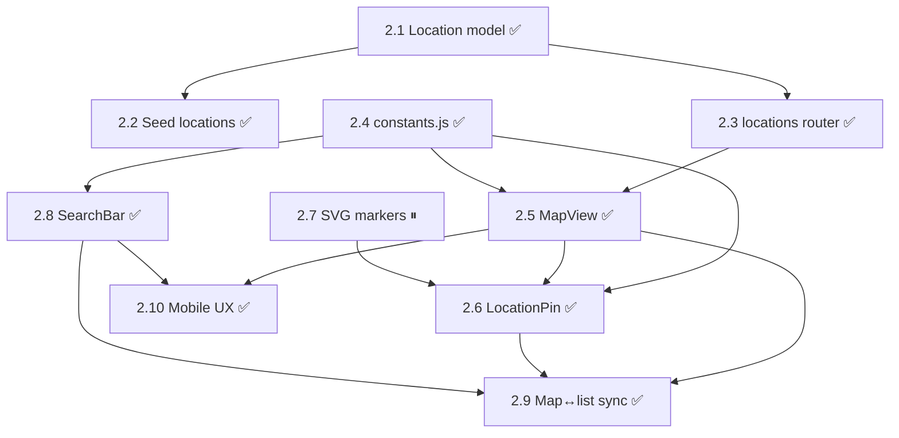

# Dev 2 Dependency Map — GIS / Mapping

**Last updated:** 2026-05-23 (Dev 2 complete: 2.1–2.6 + 2.8–2.10 ✅, 2.7 ⏸ deferred)
**Source:** `STATE.md` (post-restructure, 4-dev split)
**Workstream:** Dev 2, branch `feature/gis` — Locations data + Map UI + Spatial UX

> Scope changed materially in an earlier revision: Dev 2 now spans backend (Location model, seed, locations router) and frontend (map components, markers, search, sync, mobile UX).
>
> Nine tasks ✅ DONE: 2.1 (Location model), 2.2 (15 seed locations), 2.3 (`GET /api/locations` + `event_count`, merged via PR #12), 2.4 (`constants.js`), 2.5 (Mapbox `MapView` consuming API-fed locations via `useLocations`, now with selected/highlighted location props), 2.6 (`LocationPin`), 2.8 (`SearchBar`), 2.9 (map ↔ event list sync), and 2.10 (mobile map UX). 2.7 ⏸ DEFERRED (Lucide icons used inline instead of bespoke SVGs).

---

## Dependency Table

| Task | Title | Intra-Dev-2 deps | Cross-workstream deps | External deps | Data contracts |
|------|-------|------------------|------------------------|---------------|----------------|
| 2.1 ✅ | `models.py` — Location model | — | Shared file with Dev 1's 1.3 ✅ | SQLAlchemy | DATA MODELS § Location |
| 2.2 ✅ | `seed.py` — 15 Melbourne seed locations | 2.1 ✅ | Shares `seed.py` with Dev 1's 1.4 ✅ | — | SEED DATA § Melbourne Locations |
| 2.3 ✅ | `routers/locations.py` — `GET`/`POST /api/locations` (+ `event_count`) | 2.1 ✅ | Mounted in `main.py` (1.9 ✅); `event_count` joins Event table from 1.6 ✅ | FastAPI, Pydantic | `GET /api/locations` response (incl. `event_count`) |
| 2.4 ✅ | `constants.js` — location type config (labels, colors, icons) | — | Lives in Dev 3's Vite project (3.1 ✅) | — | Mirrors Location.type enum from 2.1 ✅ |
| 2.5 ✅ | `MapView.jsx` — Mapbox map + colored markers (Mapbox swap from Leaflet) | 2.3 ✅, 2.4 ✅ | Consumes `useLocations()` against live `GET /api/locations` (2.3 ✅); accepts `selectedLocationId` + `highlightedLocationIds` | mapbox-gl, react-map-gl | `GET /api/locations` |
| 2.6 ✅ | `LocationPin.jsx` — custom marker + popup ("See Events" CTA) | 2.4 ✅, 2.5 ✅ | "See Events" CTA deferred until events list integration | lucide-react | `GET /api/locations` shape |
| 2.7 ⏸ | Custom SVG markers in `public/markers/` (bbq, garden, kitchen) | — | Lucide icons used inline instead; deferred until designers ship bespoke SVGs | — | — |
| 2.8 ✅ | `SearchBar.jsx` — text input + type filter | 2.4 ✅ | Added to Dev 3's `Home.jsx`; filters API-fed locations plus current event list by query/type | — | `GET /api/locations` plus current event list |
| 2.9 ✅ | Map ↔ event list sync (click marker → highlight/scroll matching events) | 2.5 ✅, 2.6 ✅, 2.8 ✅ | Marker clicks select/pan map and scroll/highlight matching event cards in `Home.jsx` | — | Event `location.id` |
| 2.10 ✅ | Mobile map UX — full-width, sticky search, smooth pan/zoom | 2.5 ✅, 2.8 ✅ | Sticky search, stable mobile map height, responsive event list/FAB spacing | tailwindcss | — |

---

## Intra-Dev-2 Task Graph

---

## Critical Path

With 2.1, 2.3, 2.5, 2.6 all ✅ shipped, the remaining critical path is:

Dev 2's implementation path is complete. The only deferred item is 2.7 (bespoke SVG marker assets), which intentionally waits for designer-supplied artwork.

---

## Parallelizable Clusters

- **Backend branch:** 2.1 → 2.2 and 2.1 → 2.3 run in parallel once Dev 1's 1.3 scaffold lands. 2.2 (seed) and 2.3 (router) don't depend on each other.
- **Standalone leaves:** 2.4 (constants) and 2.7 (SVG markers) have no internal blockers once Dev 3's 3.1 (Vite init) is done. Either can be done first thing.
- **Frontend UI branch:** 2.5, 2.6, 2.8, 2.9, and 2.10 are now shipped in `Home.jsx`, `MapView.jsx`, `LocationPin.jsx`, and `SearchBar.jsx`.

---

## Earliest Unblock Points

1. **Dev 1's 1.3 (`models.py` scaffold)** — unblocks 2.1, which is the gate to all backend Dev 2 work (2.2, 2.3, and indirectly everything frontend that calls `/api/locations`).
2. **Dev 3's 3.1 (Vite app init)** — unblocks 2.4, 2.5, 2.6, 2.7, 2.8 (everything frontend). Already ✅ DONE per current STATE.md.
3. **Dev 3's 3.2 (`api.js`)** — unblocks 2.5 and 2.8. Already ✅ DONE.
4. **Dev 1's 1.9 (`main.py` mounts router)** — needed for 2.3 to be reachable end-to-end; without it the locations endpoint exists but isn't served.
5. **Dev 1's 1.6 (`GET /api/events`)** — unblocks the "See Events" CTA in 2.6 and the event-matching logic in 2.9.
6. **Dev 3's 3.7 (`Home.jsx`) + 3.8 (`EventCard`)** — satisfied; 2.9 is wired against the current event list.

No remaining unblock points for Dev 2 except designer-provided SVG marker assets for deferred task 2.7.

---

## Notes on Inferred Deps

- 2.4's location-type enum must match `Location.type` from 2.1 (`bbq` / `garden_bed` / `community_kitchen`). Not stated as a dep but drift will break marker rendering.
- 2.7 needs the Vite `public/` directory to exist, which is implicit in Dev 3's 3.1.
- 2.9 depends on the `location` object being present on event responses (per Integration Points contract). If Dev 1's 1.6 ever drops `location` from `GET /api/events`, marker/list sync breaks.
- 2.10 overlaps with Dev 3's 3.12 (mobile responsive), but the map/search side is now stable: sticky search, stable map height, and small-screen FAB spacing.
