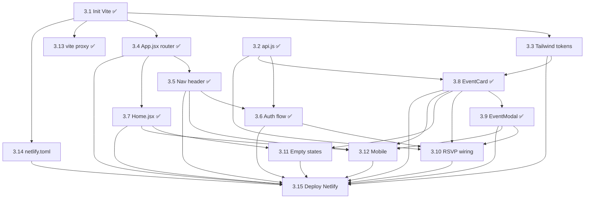

# Dev 3 Dependency Map — Frontend Foundation

**Last updated:** 2026-05-23 (3.8 EventCard + 3.9 EventModal shipped on `feat-3.8-3.9`)
**Source:** `STATE.md` (post-restructure, 4-dev split)
**Workstream:** Dev 3, branch `feature/frontend-app` — App shell + Auth + Event UI + Deploy

> Ten tasks ✅ DONE: 3.1 (Vite + React 19 + Tailwind v4 with brand tokens), 3.2 (`api.js` axios instance + `.env.example`), 3.3 (design tokens applied), 3.4 (`App.jsx` router with `/` and `/profile` placeholder routes, branch `feat-3.4`), 3.5 (`NavHeader.jsx` global sticky top bar, branch `feat-3.5`), 3.6 (`AuthModal.jsx` + `useUser` hook, user-aware NavHeader, branch `feat-3.6` PR #14), 3.7 (`Home.jsx` layout with map + slots + FAB, branch `feat-3.7`), 3.8 + 3.9 (`EventCard.jsx` + dual-mode `EventModal.jsx`, branch `feat-3.8-3.9`, wired against `SEED_EVENTS` mock and Dev 2's `useLocations` hook), 3.13 (vite proxy `/api` → `localhost:8000`). The frontend now renders a clickable map + event list + create flow plus first-visit identification against a real backend (Dev 1's users/events/locations endpoints have merged). Remaining work is 3.10 (RSVP wiring) and the deploy tail (3.11, 3.12, 3.14, 3.15). Dev 3 owns three shared files (`api.js`, `App.jsx`, `EventCard.jsx`) and the Netlify deploy tail.

---

## Dependency Table

| Task | Title | Intra-Dev-3 deps | Cross-workstream deps | External deps | Data contracts |
|------|-------|-------------------|------------------------|---------------|----------------|
| 3.1 ✅ | Init Vite + install deps | — | — | npm: react, vite, react-leaflet, leaflet, axios, react-router-dom, tailwindcss, lucide-react | — |
| 3.2 ✅ | `api.js` axios instance | 3.1 ✅ | Shared with Dev 2 (adds location endpoints) and Dev 4 (adds badge endpoints) | env: `VITE_API_URL` | — |
| 3.3 | Tailwind config + design tokens | 3.1 ✅ | — | tailwindcss | DESIGN TOKENS § |
| 3.4 ✅ | `App.jsx` — React Router | 3.1 ✅ | Shared file with Dev 4 (Dev 4 swaps the `/profile` placeholder for 4.6) | react-router-dom | — |
| 3.5 ✅ | Nav header component | 3.1 ✅, 3.4 ✅ | — | lucide-react | — |
| 3.6 ✅ | Auth flow (name + email modal) | 3.2 ✅, 3.5 ✅ | Satisfied by Dev 1's 1.5 (`POST /api/users`) now on main | localStorage | (user_id stored client-side) |
| 3.7 ✅ | `Home.jsx` — layout (search + map + list + FAB) | 3.1 ✅, 3.4 ✅ | Consumes Dev 2's 2.5 (`MapView`) ✅ merged; SearchBar (2.8) and EventCard (3.8) slots still placeholders | — | — |
| 3.8 ✅ | `EventCard.jsx` — compact card | 3.1 ✅, 3.2 ✅, 3.3 ✅ | Shipped against `SEED_EVENTS` mock; shared file with Dev 4 (4.9 attendee surfacing, 4.10 host attribution) — slots marked in source | lucide-react | `GET /api/events` (mock today; swap when Dev 1's 1.6 lands) |
| 3.9 ✅ | `EventModal.jsx` — view/create | 3.1 ✅, 3.2 ✅, 3.8 ✅ | Shipped against `SEED_EVENTS` mock; location dropdown consumes Dev 2's `useLocations` hook (live `GET /api/locations`) | — | `GET/POST /api/events` (mock today), `GET /api/locations` ✅ |
| 3.10 | Wire RSVP | 3.2 ✅, 3.6, 3.8, 3.9 | Blocked on Dev 1's 1.7 (`POST /api/events/{id}/rsvp`); Dev 4's 4.8 hooks into success callback | localStorage | `POST /api/events/{id}/rsvp` |
| 3.11 | Empty states | 3.7, 3.8 | — | — | — |
| 3.12 | Mobile responsive | 3.5, 3.7, 3.8, 3.9 | Coordinate with Dev 2's 2.10 (mobile map UX) and Dev 4's profile mobile (inferred — Dev 4 page 4.6 needs its own mobile pass) | tailwindcss | — |
| 3.13 ✅ | `vite.config.js` proxy | 3.1 ✅ | Targets Dev 1's local backend on `:8000` | vite | — |
| 3.14 | `netlify.toml` — build + `/api/*` redirect | 3.1 ✅ | Blocked on Dev 1's 1.12 (Render live URL) | Netlify | — |
| 3.15 | Deploy to Netlify, confirm end-to-end | 3.3, 3.4, 3.5, 3.6, 3.7, 3.8, 3.9, 3.10, 3.11, 3.12, 3.14 | Needs Dev 1's 1.12 (backend live) and 1.9 (CORS allowing Netlify domain); shows up at the URL Dev 1's CORS needs | Netlify, GitHub | — |

---

## Intra-Dev-3 Task Graph

---

## Critical Path (remaining TODO work)

With 3.6 ✅ shipped on `feat-3.6`, the auth gate is cleared. The longest unavoidable chain is now:

`3.10 → 3.15` (two tasks; the RSVP-then-deploy spine).

3.10 still gates the live RSVP path; Dev 1's 1.7 endpoint is merged so it's fully unblocked. 3.15 remains the final fan-in.

3.11 (empty states), 3.12 (mobile), and 3.14 (netlify.toml) are all meaningfully startable now; they remain independent leaves before 3.15.

---

## Parallelizable Clusters

- **Config branch (all parallel after 3.1 ✅):** 3.14 is a standalone leaf until 3.15.
- **Router branch:** 3.4 ✅ → 3.5 ✅ → (3.6 or 3.12).
- **Data-UI branch:** 3.3 ✅ → 3.8 ✅ → 3.9 ✅, with 3.10 as the fan-in.
- **Independent leaves before 3.15:** 3.11 and 3.12 both wait on the UI branch (now ✅) and can be picked up in parallel.

The remaining work is small enough for one engineer: 3.6 → 3.10 → 3.15 is the spine, with 3.11/3.12/3.14 as parallel leaves.

---

## Earliest Unblock Points (what other devs owe Dev 3)

1. **Dev 1's 1.5 (`POST /api/users`)** — unblocks 3.6 (auth flow), which gates 3.10 and the entire RSVP chain.
2. **Dev 1's 1.7 (RSVP endpoints)** — unblocks 3.10 (currently optimistic-local-only in `Home.jsx`).
3. **Dev 1's 1.6 (`GET /api/events`, `POST /api/events`)** — swap `SEED_EVENTS` and the local create stub in `Home.jsx` for live calls. Soft dep — 3.8/3.9 already ship against mocks.
4. **Dev 2's 2.8 (SearchBar)** — slot-in component for 3.7's search-bar placeholder. Independent of remaining Dev 3 work.
5. **Dev 1's 1.12 (Render deploy)** — final gate for 3.14 (netlify.toml redirect target) and 3.15 (end-to-end live).
6. **Dev 1's 1.9 (CORS in main.py)** — needs the Netlify domain from 3.15, circular soft coupling. Use env var.

---

## Notes on Inferred Deps

- 3.4 and 3.15 are shared coordination points: Dev 4 adds the `/profile` route in 3.4's file, and Dev 4's BadgeShelf/Profile must ship before 3.15 for the deploy to be end-to-end complete (inferred — STATE.md merge order has Dev 4 merging last, so 3.15 may need to be revisited post-Dev-4-merge).
- 3.10's success callback is the hook Dev 4's 4.8 (badge unlock celebration) attaches to. Inferred soft contract — Dev 3 must expose the callback shape.
- 3.12 (mobile) overlaps with Dev 2's 2.10 — both touch responsive rules. Coordinate to avoid conflicting Tailwind breakpoints.
- 3.14's redirect target requires Dev 1's Render URL to be stable; if Dev 1 rebuilds the service, the redirect breaks.
