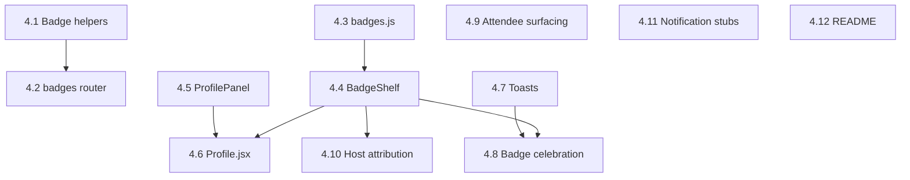

# Dev 4 Dependency Map — Badges, Notifications, Social

**Last updated:** 2026-05-23
**Source:** `STATE.md` (post-restructure, 4-dev split)
**Workstream:** Dev 4, branch `feature/social` — Engagement layer (badges + profile + social affordances)

> Dev 4 is the engagement layer that sits on top of everything else. No tasks are ✅ DONE yet. By design it merges last: STATE.md's merge order is Dev 1 → (Dev 2 + Dev 3 in parallel) → Dev 4. Every task has at least one cross-workstream blocker. The only standalone leaf is 4.3 (client badge metadata).

---

## Dependency Table

| Task | Title | Intra-Dev-4 deps | Cross-workstream deps | External deps | Data contracts |
|------|-------|-------------------|------------------------|---------------|----------------|
| 4.1 | Badge computation helpers (backend) | — | Blocked on Dev 1's 1.3 (RSVP, Event models) | SQLAlchemy | (pure functions over RSVP/Event) |
| 4.2 | `routers/badges.py` — `GET /api/users/{id}/badges` | 4.1 | Blocked on Dev 1's 1.9 (mount); reads User from 1.3, RSVP from 1.3 | FastAPI | `GET /api/users/{id}/badges` schema in INTEGRATION POINTS |
| 4.3 | `badges.js` — client badge metadata | — | Needs Dev 3's 3.1 ✅ (Vite project) | — | Mirrors BADGE_DEFINITIONS server-side (4.1) |
| 4.4 | `BadgeShelf.jsx` — earned vs. locked grid | 4.3 | Needs Dev 3's 3.1 ✅, 3.2 ✅; blocked on 4.2 (endpoint) | lucide-react | `GET /api/users/{id}/badges` |
| 4.5 | `ProfilePanel.jsx` — user stats | — | Needs Dev 3's 3.1 ✅, 3.2 ✅, 3.6 (auth provides user_id); blocked on Dev 1's 1.5 (`GET /api/users/{id}`) and 1.7 (RSVP data for "attended"/"hosted" counts) | — | `GET /api/users/{id}`, derived RSVP counts |
| 4.6 | `Profile.jsx` page | 4.4, 4.5 | Mounts at `/profile` route — shared file with Dev 3's 3.4 (`App.jsx`) | react-router-dom | — |
| 4.7 | Toast notifications | — | Needs Dev 3's 3.1 ✅; called from 3.10 (RSVP) and 4.8 (badge unlock) | (toast lib or custom) | — |
| 4.8 | Badge unlock celebration | 4.4, 4.7 | Blocked on Dev 3's 3.10 (RSVP wiring) — hooks into its success callback; re-fetches 4.2 to detect new badges | (confetti lib or custom) | `GET /api/users/{id}/badges` |
| 4.9 | Attendee surfacing on `EventCard` | — | Shared file with Dev 3's 3.8 (`EventCard.jsx`); blocked on Dev 1's 1.6 (`attendee_count` in response) | lucide-react | `GET /api/events` (`attendee_count`) |
| 4.10 | Host attribution on `EventCard` + `EventModal` | 4.4 (for badge display on host) | Shared with Dev 3's 3.8, 3.9; blocked on Dev 1's 1.6 (`host` in response); needs 4.2 to fetch host's badges | — | `GET /api/events` (`host` field), `GET /api/users/{id}/badges` |
| 4.11 | Community notification hooks (placeholder UI) | — | Needs Dev 3's 3.1 ✅; stub UI only, no backend wiring required | — | — |
| 4.12 | `README.md` — project overview, setup, deploy URLs | — | Needs all deploy URLs: Dev 1's 1.12 (Render) and Dev 3's 3.15 (Netlify); shared closeout task | — | — |

---

## Intra-Dev-4 Task Graph

---

## Critical Path

`4.1 → 4.2 → 4.4 → 4.8` is the longest pure intra-Dev-4 chain (four tasks). But the practical critical path includes the cross-workstream gate to 3.10:

`(wait on 3.10) → 4.8` and `(wait on 1.6) → 4.9 / 4.10`.

The deepest end-to-end chain Dev 4 actually executes: `4.1 → 4.2 → 4.4 → 4.8 → 4.12` (five tasks, with 4.8 also gated externally on Dev 3's 3.10).

---

## Parallelizable Clusters

- **Backend branch:** 4.1 → 4.2 (two tasks, independent of frontend).
- **Frontend metadata branch:** 4.3 → 4.4 (gated on 4.2 for live data, but UI scaffolding can land first with mocked data).
- **Profile branch:** 4.5 is independent of 4.4 until 4.6 fans them in.
- **EventCard enrichment:** 4.9 and 4.10 are siblings touching the same file (3.8). Should be sequenced or careful-merged to avoid conflicts (inferred).
- **Standalone leaves:** 4.7 (toasts), 4.11 (notification stubs), 4.12 (README) have no intra-stream deps; 4.7 and 4.11 can land any time, 4.12 is last.

---

## Earliest Unblock Points (what other devs owe Dev 4)

1. **Dev 1's 1.3 (`models.py`)** — unblocks 4.1, which gates the entire backend branch.
2. **Dev 1's 1.6 (`GET /api/events` with `host` and `attendee_count`)** — unblocks 4.9 and 4.10.
3. **Dev 1's 1.5 (`GET /api/users/{id}`)** — unblocks 4.5.
4. **Dev 1's 1.7 (RSVP endpoints with "attended" status)** — unblocks the "attended" count in 4.5 and the badge "check" lambdas in 4.1.
5. **Dev 1's 1.9 (`main.py` mount)** — needed for 4.2 to be served.
6. **Dev 3's 3.4 (`App.jsx` with `/profile` route)** — required for 4.6 to mount.
7. **Dev 3's 3.6 (auth flow)** — provides the `user_id` in localStorage that 4.4, 4.5, 4.8 all read.
8. **Dev 3's 3.8 (`EventCard.jsx`)** — base file that 4.9 and 4.10 enrich.
9. **Dev 3's 3.10 (RSVP wiring)** — exposes the success callback that 4.8 attaches to.

Practical sequencing: 4.3 and 4.11 can start immediately (Dev 3's 3.1 is done). 4.1 can start the moment Dev 1's 1.3 lands. Everything else compounds on Dev 1 and Dev 3 progress.

---

## Notes on Inferred Deps

- 4.1's badge-check lambdas reference `count_attended`, `count_hosted`, etc. These need RSVP rows with `status="attended"`, which requires Dev 1's 1.7 (`PATCH /api/rsvps/{id}` to mark attended). If 1.7 is incomplete, all "attended" badges return 0.
- 4.3 must stay in sync with 4.1 (server) — the badge `id`, `name`, `icon`, `description` fields are duplicated. Drift will cause locked/unlocked mismatches.
- 4.9 and 4.10 both modify `EventCard.jsx`. Inferred — sequence them or coordinate the merge.
- 4.10's "host's badges" pulls `GET /api/users/{id}/badges` for every event card. Potential N+1 (inferred — may want a bulk endpoint, but out of scope for today).
- 4.12 (README) implicitly depends on every other dev finishing their tasks for accurate URLs and setup steps.
