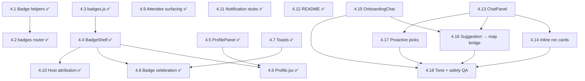

# Dev 4 Dependency Map — Badges, Notifications, Social + Maxxer

**Last updated:** 2026-05-23 (drift fix: 4.1–4.12 flipped ✅; Maxxer subtasks 4.13–4.18 added per STATE.md restructure)
**Source:** `STATE.md` (post-restructure, 4-dev split)
**Workstream:** Dev 4, branch `feature/social` — Engagement layer (badges + profile + social affordances) + Maxxer agent UX

> Badges and social layer ✅ shipped (4.1–4.12 all on main via PR #16). Remaining work is the Maxxer agent UX (4.13–4.18), which depends on Dev 1's chat endpoints (1.10.1–1.10.5) and a small Dev 3 slot (3.7.2 ChatPanel slot in `Home.jsx`).

---

## Dependency Table

| Task | Title | Intra-Dev-4 deps | Cross-workstream deps | External deps | Data contracts |
|------|-------|-------------------|------------------------|---------------|----------------|
| 4.1 ✅ | Badge computation helpers (backend) | — | Uses Dev 1's RSVP/Event models (1.3 ✅) | SQLAlchemy | `backend/badge_logic.py` |
| 4.2 ✅ | `routers/badges.py` — `GET /api/users/{id}/badges` + `/profile-stats` | 4.1 ✅ | Mounted in `main.py` (1.9 ✅) | FastAPI | `GET /api/users/{id}/badges`, `GET /api/users/{id}/profile-stats` |
| 4.3 ✅ | `badges.js` — client badge metadata + `mergeBadgePayload` | — | Lives in Dev 3's Vite project (3.1 ✅) | — | Mirrors `BADGE_DEFINITIONS` (4.1 ✅) |
| 4.4 ✅ | `BadgeShelf.jsx` — earned vs. locked grid | 4.3 ✅ | Hits 4.2 ✅; accepts `payload` prop for preview | lucide-react | `GET /api/users/{id}/badges` |
| 4.5 ✅ | `ProfilePanel.jsx` — user stats | — | Hits Dev 1's 1.5 ✅ + 4.2 ✅ profile-stats | — | `GET /api/users/{id}`, profile-stats |
| 4.6 ✅ | `Profile.jsx` page | 4.4 ✅, 4.5 ✅ | Mounted at `/profile` (Dev 3's 3.4 ✅); reads `cm.user_id` from localStorage | react-router-dom | — |
| 4.7 ✅ | Toast notifications (`ToastProvider`, `useToast`, `Toaster`) | — | Used by 3.10 RSVP and 4.8 badge unlock | — | — |
| 4.8 ✅ | Badge unlock celebration (`BadgeUnlockModal` + `useBadgeWatcher`) | 4.4 ✅, 4.7 ✅ | Triggered after RSVP via `triggerBadgeCheck()`; diff in `cm.badges.lastEarned` | — | `GET /api/users/{id}/badges` |
| 4.9 ✅ | Attendee surfacing on `EventCard` (`AttendeeChips`) | — | Sub-component for Dev 3's 3.8 ✅ to drop in; consumes 1.6 ✅ `attendee_count` | lucide-react | `GET /api/events` (`attendee_count`) |
| 4.10 ✅ | Host attribution (`HostBadge`) | 4.4 ✅ | Lazy-fetches host's top badges; for Dev 3's 3.8 ✅ / 3.9 ✅ | — | `GET /api/events` (`host`), `GET /api/users/{id}/badges` |
| 4.11 ✅ | `NotificationFeed` stub | — | UI only; backend wiring future | — | — |
| 4.12 ✅ | `README.md` — project overview | — | Draft committed; Dev 1 + 3 will fill live URLs after deploy | — | — |
| 4.13 | `ChatPanel.jsx` — Maxxer collapsible chat | — | Blocked on Dev 1's 1.10.3 (`POST /api/chat`); slot reserved by Dev 3's 3.7.2 | — | `POST /api/chat` |
| 4.14 | Inline Maxxer event recommendation cards | 4.13 | Parses `[EVENT:id]` from 1.10.5 ✅ system-prompt format; renders 3 `EventCard`s; RSVP via 3.10 when ready | — | Chat response payload (`[EVENT:id]` tags) |
| 4.15 | `OnboardingChat.jsx` — fullscreen conversational onboarding | — | Blocked on Dev 1's 1.10.4 (`POST /api/chat/onboarding`); hands completion to Dev 3's 3.7.1 gate | — | `POST /api/chat/onboarding` |
| 4.16 | Maxxer suggestion → map bridge | 4.13, 4.15 | Emits `suggested_event_ids` for Dev 2's MapView (per 2.5 follow-up) and Dev 3's `Home.jsx` (3.7.2 slot) | — | suggestion event IDs |
| 4.17 | Proactive open-app suggestions and activity nudges | 4.13 | On app open hits 1.10.3; uses preferences (1.10.2) + past RSVPs + upcoming events | — | `POST /api/chat` (proactive context) |
| 4.18 | Maxxer tone and safety QA pass | 4.13–4.17 | Sign-off task; requires real Maxxer responses (1.10.3–1.10.5) live | — | — |

---

## Intra-Dev-4 Task Graph

---

## Critical Path

**Badges/social path complete.** Original `4.1 → 4.2 → 4.4 → 4.8 → 4.12` chain is fully ✅.

**Remaining Maxxer path:** `4.13 → 4.14 → 4.18` (three tasks). 4.15 (onboarding) is independent of 4.13 and lands in parallel; 4.16 and 4.17 fan in before 4.18.

---

## Parallelizable Clusters (remaining work)

- **Independent kick-offs:** 4.13 (ChatPanel) and 4.15 (OnboardingChat) are sibling entry points — both blocked on Dev 1's chat endpoints but not on each other.
- **Fan-in:** 4.14, 4.16, 4.17 each consume 4.13 + their own backend dep (1.10.3 / 1.10.4 / 1.10.5).
- **Sign-off:** 4.18 is the final QA pass — requires all Maxxer surfaces live.

---

## Earliest Unblock Points (what remaining Dev 4 work owes other streams)

1. **4.13 ChatPanel** — provides the live Maxxer surface for the app shell; consumed by Dev 3's 3.7.2 slot.
2. **4.16 Suggestion → map bridge** — emits `suggested_event_ids` that Dev 2's MapView highlights (per 2.5's follow-up note).
3. **4.15 OnboardingChat** — required for Dev 3's 3.7.1 gate to render meaningfully.

---

## Notes on Inferred Deps

- 4.14's "exactly 3 real events" enforcement leans on Dev 1's 1.10.5 (system prompt + parsing). If the backend can't constrain the model's choices to real event IDs, the UI will need its own filtering layer.
- 4.16's map bridge is a soft coupling with Dev 2's 2.5 — adding `highlightedEventIds` (or location IDs) to MapView is a Dev 2 follow-up. Coordinate when 4.16 starts.
- 4.17 (proactive picks) runs on app open, which means it lives in the app shell (Dev 3 owns `App.jsx`). Inferred — Dev 3 will need to host the trigger call.
